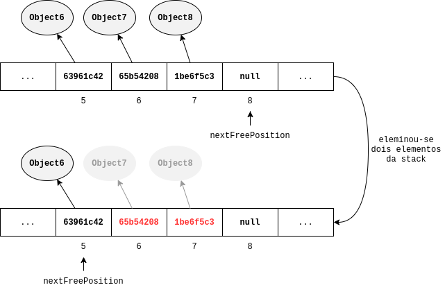

# Effective Java
Anotações e exemplos do livro Effective Java de Joshua Bloch.

## Capítulo 2: Criando e destruindo objetos

### Item 2: considere utilizar builders quando o construtor tiver muitos argumentos

Esta estratégia é muito adequada para os casos em que a classe possui vários atributos opcionais na sua composição. 
Algumas **outras alternativas** são:
* Utilizar o padrão _**telescoping constructor**_ - quando você cria vários construtores na classe, dando mais 
  opções de inicialização. Ex.:
  ```java
  // ... atributos da classe declarados como final
  public NutritionFacts(int servingSize, int servings) {
    this(servingSizes, servings, 0) // chama um construtor com 3 argumentos
  }
  
  public NutritionFacts(int servingSize, int servings, int calories) {
    this(servingSizes, servings, calories, 0) // chama um construtor com 4 argumentos
  }
  
  public NutritionFacts(int servingSize, int servings, int calories, int fat) {
    this.servingSize = servingSize;
    this.servings = servings;
    this.calories = calories;
    this.fat = fat;
  }
  // ...
  ```
  mesmo com uma variedade de construtores, muitas vezes não é possível ter plena flexibilidade para inicializar apenas 
  os atributos desejados. A leitura ainda se tornar difícil para um número muito grande de argumentos.

* Utilizar o padrão _**JavaBeans**_ - na classe haverá apenas o construtor *default* (construtor sem argumentos) e 
  você fará uso dos métodos *setters* para inicializar os atributos desejados, isso facilita a legibilidade.   
  Uma clara desvantagem dessa abordagem é que sua classe precisa ser mutável, ou seja, os atributos de classe não 
  podem ser declarados como `final`.

Utilizando o padrão _builder_ temos as vantagens das duas alternativas citadas acima: classes imutáveis e 
legibilidade ao inicializar objetos. Ex.:
```java
NutritionFacts cocaCola = new NutritionFacts.Builder(240, 0) // (servingSize, servings)
                .calories(10)
                .sodium(35)
                .build();
```
perceba que em `Builder` forçamos o programador a inicializar os atributos obrigatórios e os opcionais não 
facilmente inseridos. A construção da classe acima pode ser encontrada no pacote `br.rochards.item2.builder`.

O padrão _builder_ também pode ser utilizado com classes abstratas (...)

:bulb: uma alternativa interessante para construir _builders_ é utilizar o projeto
[lombok](https://projectlombok.org/features/Builder).


### Item 4: force classes não instanciáveis com um construtor privado

Essa situação é bastante válida para aquelas classes que contêm apenas métodos e atributos estáticos. Podem ser 
consideradas classes utilitárias.

Lembre-se que o compilador Java fornece um construtor *default* (sem parâmetros) sempre que nenhum construtor é 
explicitamente declarado na classe. Então a estratégia consiste em criar um construtor privado:
```java
// classe utilitária não instanciável
public class UtilityClass {
    // suprime o construtor default com a declaração explícita
    private UtilityClass() {
        throw new AssertionError(); // não é obrigatório, está aqui só pro caso de instanciarem dentro da própria classe
    }
    // ...
}
```
:speech_balloon: nenhuma outra classe conseguiria ser subclasse de `UtilityClass`, pois não teria acesso ao 
construtor dela.

### Item 5: prefira injeção de dependência para integrar recursos

Não é incomum classes dependerem de outras para compor sua lista de atributos. Dependendo da forma como você os 
instancia dentro da classe, pode torná-la inflexível. Vamos ao exemplo:
```java
// uso inapropriado de um singleton - inflexível e não testável
public class SpellChecker {
    private final Lexicon dictionary = new Lexicon("pt-br");
    private SpellChecker() {}
    public static final SpellChecker INSTANCE = new SpellChecker(); // singleton pq só vai existir uma instância na memória
    
    public boolean isValid(String word) { /* ... */ }
    public List<String> suggestions(String typo) { /* ... */ }
}
```
o problema acima é que `SpellChecker` só valida palavras em um único idioma. 

:no_entry_sign: *singletons* e classe estáticas utilitárias não são adequadas para construir classes cujo 
comportamento depende de outros recursos (neste caso outra classe).

A recomendação é passar o recurso necessário pelo construtor ao criar uma nova instância da classe, é a chamada 
**injeção de dependência**:
```java
// injeção de dependência fornece flexibilidade e facilidade para testar
public class SpellChecker {
  private final Lexicon dictionary;

  public SpellChecker(Lexicon dictionary) {
    this.dictionary = Objects.requireNonNull(dictionary);
  }

  public boolean isValid(String word) { /* ... */ }
  public List<String> suggestions(String typo) { /* ... */ }
}
```


### Item 6: evite criar objetos desnecessariamente

Dê preferência em reutilizar a criar novas instâncias em se tratando de objetos imutáveis. Um exemplo seria:
```java
String s = new String("foo bar");
```
a linha acima sempre cria uma nova `String` cada vez que é executada, ou seja, uma nova instância desse objeto será 
criado na memória. Considere fazer:
```java
String s = "foo bar";
```
agora a mesma instância será utilizada todas as vezes que a linha acima for executada. **Essa abordagem pode melhorar a 
performance da sua aplicação**, por exemplo, dentro de um *loop*.

:warning: essa estratégia é segura porque uma `String` é um objeto imutável no Java.

Como mais um exemplo, vamos analisar o método abaixo que calcula a soma de todos os inteiros positivos:
```java
public static long sum(){
    Long sum = 0L;
    for(long i = 0; i <= Integer.MAX_VALUE; i++){
        sum += i; // é criada uma nova instância de sum a cada iteração pq é um Long
    }
    return sum;
}
```
se `sum` tivesse sido declarado como `long` em vez de `Long` a performance seria melhor para esse *loop*.

### Item 7: elimine referências a objetos obsoletos

Quando trabalhamos com Java, erroneamente pensamos que não devemos nos preocupar com gerenciamento de memória, uma 
vez que temos o *garbage collector* para fazer esse trabalho. No entanto, existem algumas situações em que o 
programador deve proativamente eliminar a referência a objetos obsoletos. Veja o exemplo da classe `Stack` no pacote 
`br.rochards.item7`, o problema se encontra no método `pop`:
```java
public Object pop() {
    if (size == 0)
        throw new EmptyStackException();
    return elements[--nextFreePosition];
}
```
`elements` é um *array* de objetos, e precisamos lembrar que esses tipos de *arrays* guardam apenas referências para 
objetos que estão alocados em algum lugar na memória. Quando utilizamos o método `pop` acima estamos apenas 
decrementando um contador para indicar que aquela posição agora está livre, mas as referências não foram removidas, 
como pode ser visto na figura abaixo

perceba na figura acima que as posições 6 e 7 ainda possuem referências para objetos, portanto continuam ocupando 
espaço na memória e não serão removidos pelo *garbage collector*. Uma forma de resolver esse problema seria
```java
public Object pop() {
    if (size == 0)
        throw new EmptyStackException();
    Object result = elements[--nextFreePosition];
    elements[nextFreePosition] = null; // elimina a referência obsoleta
    return result;
}
```
De uma forma geral, **sempre que uma classe gerencia seu próprio espaço ocupado na memória, como a `Stack` acima, o 
programador deve estar alerta para vazamentos de memória (_memory leak_)**.

### Item 8: evite *finalizers* e *cleaners*

*Finalizers* são imprevisíveis, muitas vezes perigosos e geralmente desnecessários, então como uma regra geral você 
deve evitar seu uso. A partir do Java 9, *finalizers* forão descontinuados e substituídos por *cleaners*. *Cleaners* 
são menos perigosos do que *finalizers*, mas também são lentos e geralmente desnecessários.

Um defeito de *finalizers* e *cleaners* é que não há garantias que eles serão executados imediatamente. Isso 
significa que **você não deve executar nada crítico no tempo em um _finalizer_ ou _cleaner_**, como por exemplo 
fechar arquivos, pois *file descriptors* são recursos limitados e se deixados abertos pode impedir que outros 
programas abram arquivos. Um outro exemplo é não depender de *finalizers* e *cleaners* para atualizar informações em 
um banco de dados. 

(completar...)

### Item 9: prefira *try-with-resources* a *try-finally* 

Há muitos recursos Java que precisam ser explicitamente fechados invocando um método `close`. Um exemplo é a classe 
`java.io.BufferedReader`. No entanto, muitas vezes o programador esquece de fazer isso, o que pode acarretar 
problemas de desempenho na aplicação.

Vamos a um exemplo utilizando *try-finally*:
```java
public static String readFirstLineOfFile(String path) throws IOException {
    var br = new BufferedReader(new FileReader(path));
    try {
        return br.readLine(); // pode lançar IOException
    } finally {
        br.close(); // pode lançar IOException
    }
}
```
ambas as linhas marcadas acima podem lançar a exceção indicada, acontece que se as duas linhas a lançarem, aparecerá 
no *stack trace* apenas a exceção de `br.close()`, dificultando o *debugging*.

O tratamento das exceções acima pode ser melhorado com *try-with-resources*, basta que a classe ou a sua superclasse 
implemente a interface **`AutoCloseable`**:
```java
public static String readFirstLineOfFile(String path) throws IOException {
    try (var br = new BufferedReader(new FileReader(path))) {
        return br.readLine(); // pode lançar IOException
    }
}
```
*try-with-resources* melhora a legibilidade do código e o método `close` é chamado de forma implícita. Se ambos os 
métodos `readLine` e `close` lançarem exceções, a última é suprimida para facilitar o diagnóstico do problema, mas 
ainda assim indicada na *stack trace*.

:nerd_face: em `br.rochards.item9.File` há mais exemplos de como utilizar o *try-with-resources* pode melhorar 
a legibilidade do código. 

:memo: Prefira *try-with-resources* a *try-finally* quando estiver trabalhando com recursos que devem ser fechados.


## Capítulo 3: Métodos comuns para todos os objetos